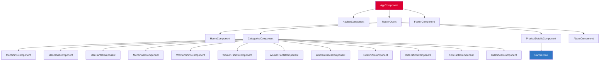

<div align="center">


# E-Commerce Angular Store

### Fashion Clothing Store · Angular 18 · TailwindCSS + Bootstrap 5

<br/>

[](https://angular.dev/)
[](https://www.typescriptlang.org/)
[](https://tailwindcss.com/)
[](https://getbootstrap.com/)
[](https://rxjs.dev/)

[](https://github.com/Jaser1010/ecommerce-angular-store)
[](https://github.com/Jaser1010/ecommerce-angular-store/commits/main)
[](https://github.com/Jaser1010/ecommerce-angular-store/stargazers)
[](LICENSE)

<br/>

*A modern, responsive fashion clothing e-commerce storefront built with Angular 18 standalone components.*
*Browse clothing for Men, Women, and Kids across Shirts, T-Shirts, Pants, and Shoes —*
*with an auto-sliding ad carousel, product detail pages, cart functionality, and a polished UI.*

<br/>

[🚀 Quick Start](#-quick-start) · [🐛 Report Bug](https://github.com/Jaser1010/ecommerce-angular-store/issues) · [💡 Request Feature](https://github.com/Jaser1010/ecommerce-angular-store/issues)

</div>

---

<br/>

## 📑 Table of Contents

<details>
<summary>Click to expand</summary>

- [Highlights](#-highlights)
- [Architecture Overview](#-architecture-overview)
- [Project Structure](#-project-structure)
- [Tech Stack](#-tech-stack)
- [Features in Detail](#-features-in-detail)
- [Quick Start](#-quick-start)
- [Component Map](#-component-map)
- [Routing](#-routing)
- [Roadmap](#-roadmap)
- [Contributing](#-contributing)
- [License](#-license)
- [Author](#-author)

</details>

<br/>

---

## ⚡ Highlights

<table>
<tr>
<td width="50%">

🛍️ **3 Category Sections**
Complete product catalogs for **Men**, **Women**, and **Kids** — each with 4 subcategories: Shirts, T-Shirts, Pants, and Shoes. That's **12 product listing pages** in total.

</td>
<td width="50%">

🎠 **Auto-Sliding Ad Carousel**
Home page hero carousel with 3-second auto-advance, next/prev navigation, dot indicators, and hover-to-pause — all built with pure TypeScript, no external carousel library.

</td>
</tr>
<tr>
<td width="50%">

🛒 **Shopping Cart Service**
Injectable `CartService` with `addToCart()`, `getCart()`, and `clearCart()` methods. Cart state is managed in-memory and accessible from any component.

</td>
<td width="50%">

📱 **Responsive Design**
Dual CSS framework approach: **TailwindCSS** for utility-first styling + **Bootstrap 5** for responsive grid and component classes. Hamburger menu for mobile navigation.

</td>
</tr>
<tr>
<td width="50%">

🧱 **Standalone Components**
Built with Angular 18's modern **standalone component architecture** — no NgModules required. Each component declares its own imports for maximum encapsulation.

</td>
<td width="50%">

🔍 **Product Details**
Dedicated product detail page with image display, description, pricing, **Add to Cart** button, and **Buy Now** action — navigated via route parameter `/product-list/:id`.

</td>
</tr>
<tr>
<td width="50%">

📸 **200+ Product Images**
Full product image library organized by category: `men/men-shirts/`, `women/women-pants/`, `kids/kids-shoes/`, etc. — real fashion photography, not placeholders.

</td>
<td width="50%">

🏠 **Featured Products**
Home page showcases 12 featured products in a grid with product cards displaying image, name, and price — each linking to its detail page via `viewDetails(productId)`.

</td>
</tr>
</table>

---

## 🏛 Architecture Overview

The application uses **Angular 18 Standalone Components** with a flat component-based architecture:

```
┌─────────────────────────────────────────────────────────────┐
│                          APP SHELL                          │
│  AppComponent (navbar + router-outlet + footer)             │
│  ┌─────────────┐  ┌──────────────────────┐  ┌───────────┐  │
│  │   Navbar    │  │    <router-outlet>    │  │  Footer   │  │
│  │  Component  │  │                      │  │ Component │  │
│  └─────────────┘  │  ┌────────────────┐  │  └───────────┘  │
│                   │  │  HomeComponent │  │                  │
│                   │  │  Ad Carousel   │  │                  │
│                   │  │  Product Grid  │  │                  │
│                   │  └────────────────┘  │                  │
│                   │  ┌────────────────┐  │                  │
│                   │  │  Categories    │  │                  │
│                   │  │  Men / Women   │  │                  │
│                   │  │  / Kids Grid   │  │                  │
│                   │  └────────────────┘  │                  │
│                   │  ┌────────────────┐  │                  │
│                   │  │ ProductDetails │  │                  │
│                   │  │ + CartService  │  │                  │
│                   │  └────────────────┘  │                  │
│                   └──────────────────────┘                  │
└─────────────────────────────────────────────────────────────┘
```

### Service Layer

| Service | Scope | Methods | Description |
|:--------|:------|:--------|:------------|
| `CartService` | `providedIn: 'root'` | `addToCart(product)`, `getCart()`, `clearCart()` | Global singleton managing the shopping cart state in-memory |

---

## 📁 Project Structure

```
ecommerce-angular-store/
│
├── src/
│   ├── app/
│   │   ├── app.component.ts/html/css        # Root shell — navbar, carousel, footer, router-outlet
│   │   ├── app.routes.ts                    # Route definitions (16 routes)
│   │   ├── app.config.ts                    # App configuration + providers
│   │   ├── cart.service.ts                  # Global CartService (add/get/clear)
│   │   ├── routes.ts                        # Secondary routes file
│   │   │
│   │   ├── 🏠 home/                         # Home page
│   │   │   └── home.component.ts/html/css   # Featured products grid + ad slider + Special Offers
│   │   │
│   │   ├── 📂 Categories/                   # Category hub
│   │   │   └── Categories.component.ts/html # Category cards: Men / Women / Kids × Shirts/T-shirts/Pants/Shoes
│   │   │
│   │   ├── 🔍 product-details/              # Product detail page
│   │   │   └── product-details.component.*  # Image, description, price, Add to Cart, Buy Now
│   │   │
│   │   ├── ℹ️ about/                         # About Us page
│   │   │   └── about.component.ts/html      # Company info with images
│   │   │
│   │   ├── 🧭 navbar/                       # Navbar component
│   │   │   └── navbar.component.ts/html/css # Responsive nav with hamburger menu
│   │   │
│   │   ├── 📢 ad-slider/                    # Ad slider component
│   │   │   └── ad-slider.component.*        # Carousel sub-component
│   │   │
│   │   ├── 🦶 footer/                       # Footer component
│   │   │   └── footer.component.ts/html     # Quick Links, Services, Social Media
│   │   │
│   │   ├── 👔 men/                           # Men's product pages
│   │   │   ├── MenShirts/                   # 20 shirts with hardcoded product data
│   │   │   ├── men-tshirt/                  # T-shirts collection
│   │   │   ├── men-pants/                   # Pants collection (16 products)
│   │   │   └── men-shoes/                   # Shoes collection (18 products)
│   │   │
│   │   ├── 👗 women/                         # Women's product pages
│   │   │   ├── women-shirts/                # 19 shirts
│   │   │   ├── women-tshirts/               # T-shirts collection
│   │   │   ├── women-pants/                 # Pants collection (13 products)
│   │   │   └── women-shoes/                 # Shoes collection (9 products)
│   │   │
│   │   └── 👶 kids/                          # Kids' product pages
│   │       ├── kids-shirts/                 # 16 shirts
│   │       ├── kids-tshirts/                # T-shirts collection (10 products)
│   │       ├── kids-pants/                  # Pants collection (8 products)
│   │       └── kids-shoes/                  # Shoes collection (8 products)
│   │
│   ├── assets/
│   │   └── images/                          # 200+ product photos
│   │       ├── men/                         # men-shirts/, men-pants/, men-shoes/, men-t-shirt/
│   │       ├── women/                       # women-shirts/, women-pants/, women-shoes/, women-t-shirt/
│   │       ├── kids/                        # kids-shirts/, kids-pants/, kids-shoes/, kids-t-shirts/
│   │       ├── ad1.jpg, ad2.jpg, ad4.jpg    # Carousel ad banners
│   │       ├── logo.jpg                     # Store logo
│   │       └── aboutUs.jpeg, aboutUs2.jpg   # About page images
│   │
│   ├── index.html                           # Entry HTML
│   ├── main.ts                              # Bootstrap standalone AppComponent
│   └── styles.css                           # Global CSS imports (Tailwind directives)
│
├── angular.json                             # Angular CLI workspace config
├── package.json                             # Dependencies (Angular 18 + Tailwind + Bootstrap)
├── tailwind.config.js                       # TailwindCSS config
├── postcss.config.js                        # PostCSS with Tailwind + Autoprefixer
├── tsconfig.json                            # TypeScript compiler config
├── eslint.config.mjs                        # ESLint flat config
└── .gitignore
```

---

## 🛠️ Tech Stack

| Category | Technology | Version | Purpose |
|:---------|:-----------|:--------|:--------|
| **Framework** | [Angular](https://angular.dev/) | 18.2 | Component-based SPA framework |
| **Language** | [TypeScript](https://www.typescriptlang.org/) | 5.5 | Type-safe JavaScript |
| **Styling** | [TailwindCSS](https://tailwindcss.com/) | 3.4 | Utility-first CSS framework |
| **UI Library** | [Bootstrap](https://getbootstrap.com/) | 5.3 | Responsive grid + components |
| **Routing** | [@angular/router](https://angular.dev/guide/routing) | 18.2 | Client-side navigation |
| **Reactive** | [RxJS](https://rxjs.dev/) | 7.8 | Observable-based data streams |
| **PostCSS** | [PostCSS](https://postcss.org/) + [Autoprefixer](https://autoprefixer.github.io/) | 8.4 | CSS processing pipeline |
| **Tooltips** | [@popperjs/core](https://popper.js.org/) | 2.11 | Bootstrap tooltip positioning |
| **Linting** | [ESLint](https://eslint.org/) + [typescript-eslint](https://typescript-eslint.io/) | 9.11 | Code quality enforcement |
| **Testing** | [Karma](https://karma-runner.github.io/) + [Jasmine](https://jasmine.github.io/) | 6.4 / 5.2 | Unit testing framework |
| **Build** | [Angular CLI](https://angular.dev/tools/cli) | 18.2.3 | Dev server, build, scaffolding |

---

## 🎯 Features in Detail

### 🏠 Home Page

- **Hero Ad Carousel** — 3 promotional banners with auto-slide (3s interval), prev/next arrows, dot indicators
- **Special Offers** section
- **Featured Products Grid** — 12 product cards with image, name, price, and "View Details" click navigation
- Responsive layout adapting to mobile/tablet/desktop

### 📂 Category Navigation

- **Category Hub** — Visual grid with Men, Women, and Kids sections
- Each section shows 4 subcategory links: **Shirts**, **T-Shirts**, **Pants**, **Shoes**
- Animated category cards with hover effects

### 👔👗👶 Product Listing Pages (12 pages)

Each of the 12 product pages features:

- Hardcoded product arrays with `id`, `name`, `price`, `imageUrl`, and `description`
- Product cards in a responsive grid layout
- Hover effects on product images
- Sorting/filtering by price (ascending/descending/default)
- Click-to-view product details

| Category | Shirts | T-Shirts | Pants | Shoes |
|:---------|:-------|:---------|:------|:------|
| **Men** | 20 products | 11 products | 16 products | 18 products |
| **Women** | 19 products | 14 products | 13 products | 9 products |
| **Kids** | 16 products | 10 products | 8 products | 8 products |

### 🔍 Product Details

- Full-page product view with large image display
- Product name, description, and formatted price
- **Add to Cart** button → triggers `CartService.addToCart()` with confirmation alert
- **Buy Now** button → navigates to checkout flow
- 404 redirect for invalid product IDs

### 🛒 CartService

```typescript
@Injectable({ providedIn: 'root' })
export class CartService {
  private cart: Product[] = [];
  addToCart(product: Product): void   // Push product into cart
  getCart(): Product[]                // Return all cart items
  clearCart(): void                   // Empty the cart
}
```

### 🧭 Navigation

- Desktop: Horizontal navbar with **Home**, **Categories**, **About**, **Contact** links
- Mobile: Hamburger toggle menu with animated show/hide (`isMenuOpen` state)
- Active route highlighting with `RouterLinkActive`

### 🦶 Footer

- Three-column layout: **Company Description**, **Quick Links**, **Services**
- Social media links: Facebook, Twitter, Instagram
- Clean layout with consistent brand styling

---

## 🚀 Quick Start

### Prerequisites

| Requirement | Minimum Version | Download |
|:------------|:----------------|:---------|
| **Node.js** | 18.x | [nodejs.org](https://nodejs.org/) |
| **npm** | 9.x | Bundled with Node.js |
| **Angular CLI** | 18.x | `npm install -g @angular/cli` |

### Step-by-Step Setup

```bash
# 1. Clone the repository
git clone https://github.com/Jaser1010/ecommerce-angular-store.git
cd ecommerce-angular-store

# 2. Install dependencies
npm install

# 3. Start development server
ng serve
# or
npm start

# 4. Open in browser
# Navigate to http://localhost:4200
```

> 💡 **Tip:** The app auto-reloads when you modify source files.

### Other Commands

```bash
# Run unit tests
ng test

# Build for production
ng build

# Lint code
ng lint
```

---

## 🗺️ Component Map



---

## 🛤️ Routing

| Path | Component | Description |
|:-----|:----------|:------------|
| `/` | `HomeComponent` | Landing page with carousel + featured products |
| `/Home` | `HomeComponent` | Alias for home |
| `/Categories` | `CategoriesComponent` | Category hub with Men/Women/Kids |
| `/Categories/MenShirts` | `MenShirtsComponent` | Men's shirts catalog |
| `/Categories/MenTshirt` | `MenTshirtComponent` | Men's t-shirts catalog |
| `/Categories/MenPants` | `MenPantsComponent` | Men's pants catalog |
| `/Categories/MenShoes` | `MenShoesComponent` | Men's shoes catalog |
| `/Categories/WomenShirts` | `WomenShirtsComponent` | Women's shirts catalog |
| `/Categories/WomenTshirts` | `WomenTshirtsComponent` | Women's t-shirts catalog |
| `/Categories/WomenPants` | `WomenPantsComponent` | Women's pants catalog |
| `/Categories/WomenShoes` | `WomenShoesComponent` | Women's shoes catalog |
| `/Categories/KidsShirts` | `KidsShirtsComponent` | Kids' shirts catalog |
| `/Categories/KidsTshirts` | `KidsTshirtsComponent` | Kids' t-shirts catalog |
| `/Categories/KidsPants` | `KidsPantsComponent` | Kids' pants catalog |
| `/Categories/KidsShoes` | `KidsShoesComponent` | Kids' shoes catalog |
| `/product-list/:id` | `ProductDetailsComponent` | Product detail page |
| `/about` | `AboutComponent` | About the store |

---

## 🗺️ Roadmap

#### ✅ Completed

- [x] Angular 18 standalone component architecture
- [x] 12 product category pages (Men/Women/Kids × Shirts/T-shirts/Pants/Shoes)
- [x] Product detail page with Add to Cart & Buy Now
- [x] CartService for cart management
- [x] Auto-sliding ad carousel with controls
- [x] Responsive navbar with hamburger toggle
- [x] Footer with Quick Links, Services, Social
- [x] About page
- [x] 200+ real product images
- [x] TailwindCSS + Bootstrap 5 hybrid styling
- [x] Price sorting (ascending/descending)
- [x] ESLint configuration

#### 🔜 Coming Soon

- [ ] 🔐 **User Authentication** — Login/Register with JWT or Firebase Auth
- [ ] 💳 **Checkout Flow** — Complete checkout with payment integration (Stripe/PayPal)
- [ ] 🛒 **Cart Page** — Dedicated cart page with quantity adjustment and total calculation
- [ ] 🔎 **Search & Filter** — Global product search with advanced filtering (size, color, price range)
- [ ] 🗄️ **Backend API** — Connect to a real REST API instead of hardcoded product data
- [ ] ❤️ **Wishlist** — Save favorite products for later
- [ ] 📱 **PWA Support** — Progressive Web App for offline browsing
- [ ] 🧪 **E2E Tests** — Cypress or Playwright end-to-end testing
- [ ] 🐳 **Docker** — Containerized deployment

---

## 🤝 Contributing

Contributions are welcome! Fork the repo, create a feature branch, and submit a Pull Request.

```bash
git checkout -b feature/amazing-feature
git commit -m "feat: add amazing feature"
git push origin feature/amazing-feature
```

---

## 📄 License

Distributed under the **MIT License**.

---

## 👤 Author

<table>
<tr>
<td align="center">
<a href="https://github.com/Jaser1010"><b>Jaser Kasim</b></a>
<br/><sub>Software Engineer</sub>
<br/><br/>
<a href="https://github.com/Jaser1010"></a>
<a href="https://www.linkedin.com/in/jaser-kasim-j1k2/"></a>
</td>
</tr>
</table>

---

<div align="center">

**If you found this project helpful, consider giving it a ⭐**

Built with ❤️ using **Angular 18** and **TypeScript**

</div>
